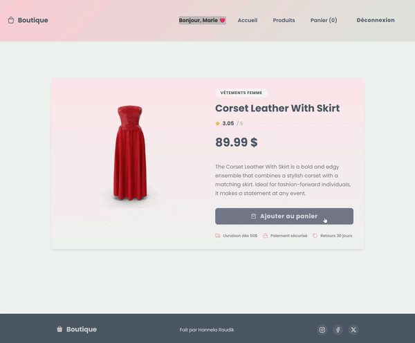
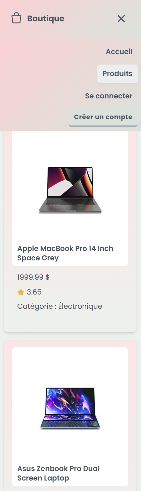

# Vue Commerce

Frontend e-commerce web application built with Vue 3, Vite, and Firebase authentication.

## Live Demo
https://vue-boutique.netlify.app 


## Overview

This project is a front-end e-commerce application that allows users to browse products, view details, and manage a shopping cart.

The focus was on building a clean user interface, implementing authentication with Firebase, and managing application state using Pinia.


## Technologies

- Vue 3 (Composition API)
- Vite
- JavaScript (ES6+)
- Firebase Authentication
- Pinia (state management)
- DummyJSON API
- CSS (custom design system with CSS variables)

## Features

- Product listing with category filtering
- Product detail view
- User authentication (register, login, logout via Firebase)
- Protected routes (only authenticated users can access cart)
- Add and remove items from cart with confirmation dialog
- Dynamic cart updates (subtotal, taxes, total)
- Cart persistence using localStorage (refresh)
- Firebase session persistence (user stays logged in after refresh)
- Responsive design (mobile hamburger menu, desktop layout)

## Demo

### Protected Flow


### Cart Flow


## Preview

### Mobile



## Environment Variables

Create a `.env` file at the root:

```
VITE_FIREBASE_API_KEY=your_key
VITE_FIREBASE_AUTH_DOMAIN=your_domain
VITE_FIREBASE_PROJECT_ID=your_project_id
VITE_FIREBASE_STORAGE_BUCKET=your_storage_bucket
VITE_FIREBASE_MESSAGING_SENDER_ID=your_sender_id
VITE_FIREBASE_APP_ID=your_app_id
```

### Future Improvements

- Sync cart data with Firestore for authenticated users
- Merge guest cart with user account after login

Hannela Raudik  
GitHub: https://github.com/otsingx